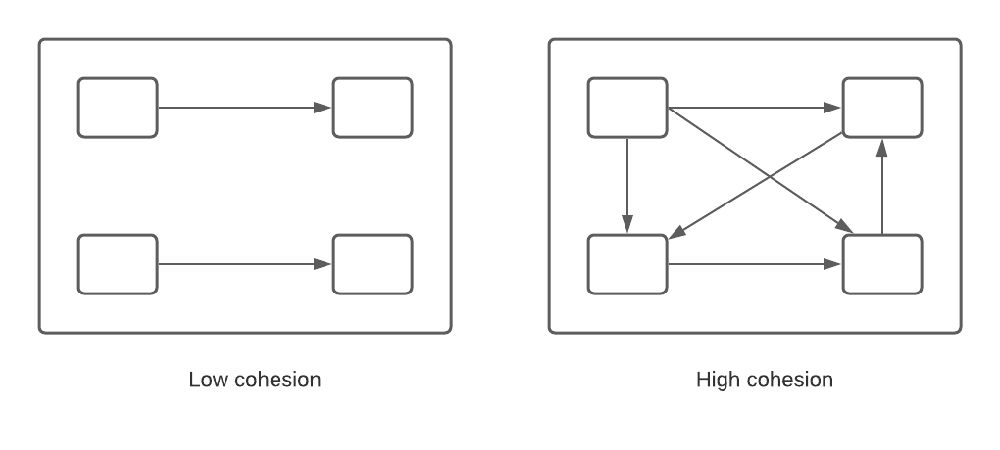
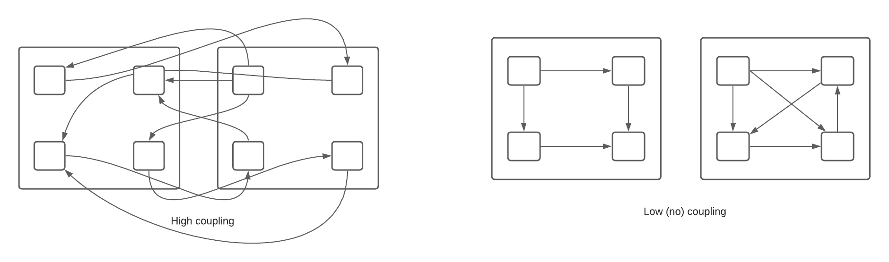
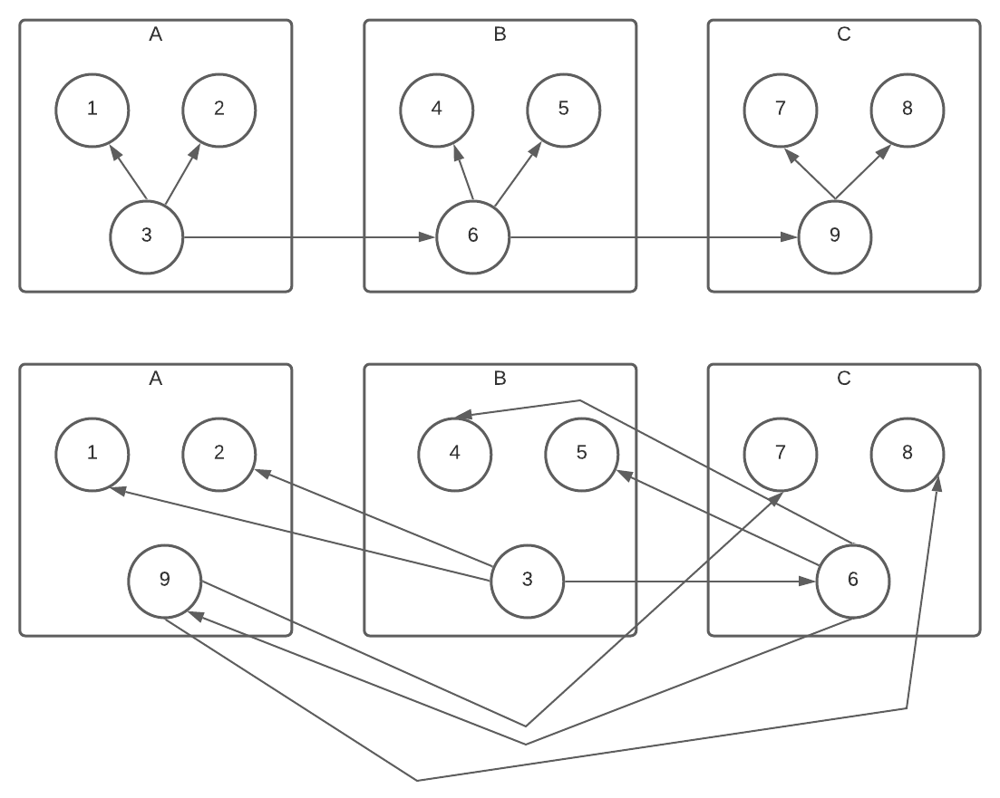
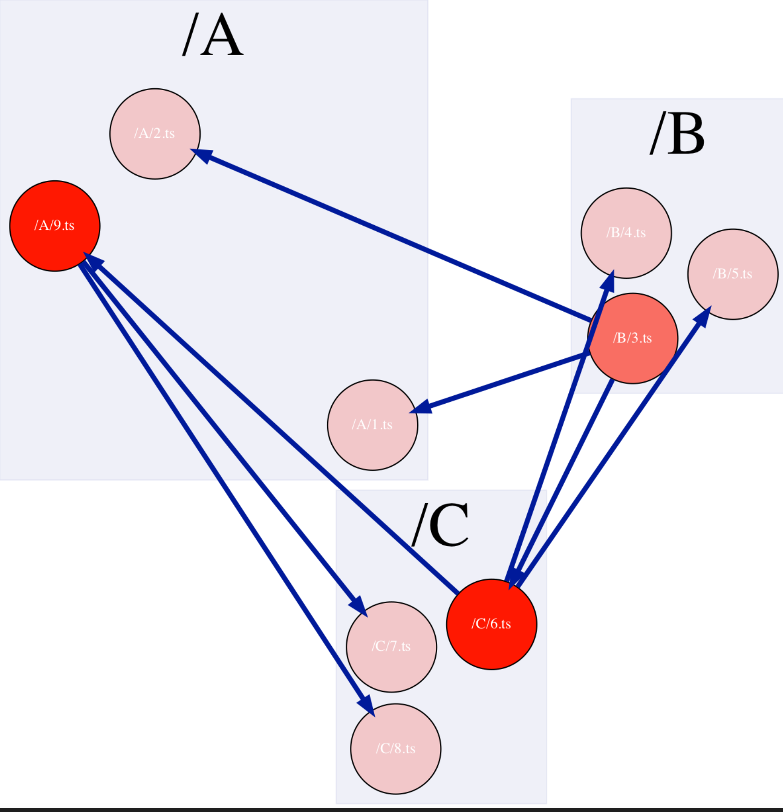
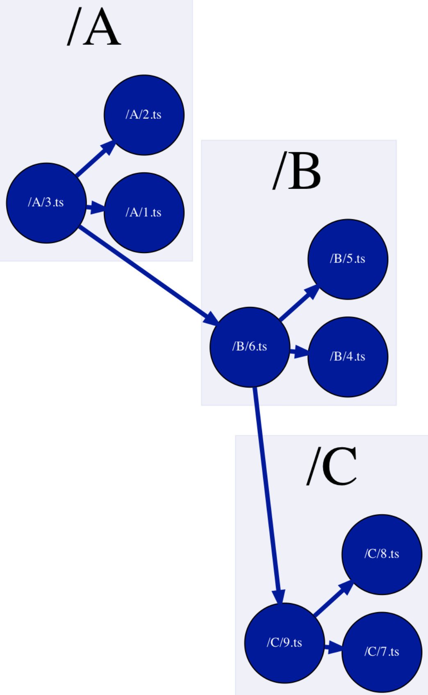
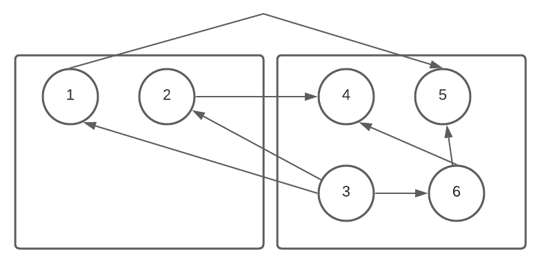
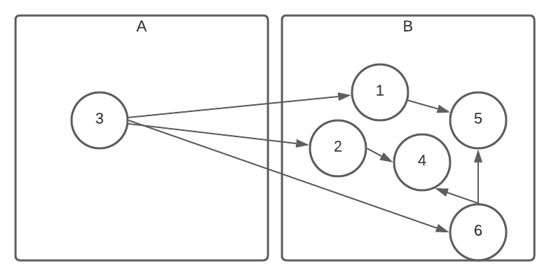
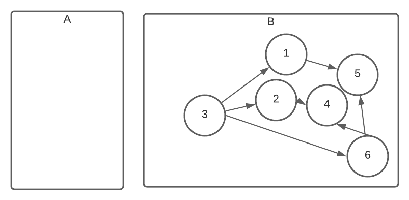
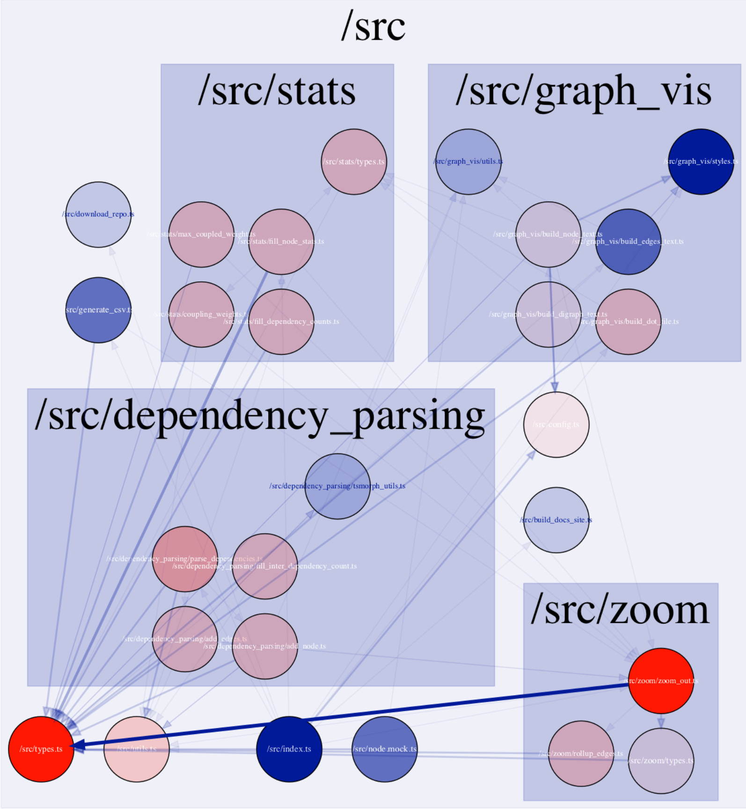

_Measuring Coupling and Cohesion of TypeScript code bases_

Earlier this month I was exploring creating [dependency graphs of github repositories](https://www.staceygammon.com/architecture_art/). The one thing lacking from that exploration was having something actionable come out of the graph. How can you tell, especially for very large, complicated repositories, whether the graph is well-organized, or a tightly coupled mess?

## Cohesion

Cohesion can be thought of as how well components in a single module fit together. In the following image, the visualization on the right has higher cohesion than the left. But how do you measure it? It's easy to compare the cohesion of two modules, but what if there was just a single visualization? How could you say whether is was cohesive "enough" or not?



## Coupling

Coupling is how tightly connected components in _separate_ modules are. In the following image, the visualization on the left has tighter higher coupling than the right. Again, how do you measure it, and determine whether it's coupling is "good" or "bad"? Any software engineer could look at the image on the left and tell you it was a terribly organized code base. Aiming for 0 coupling is also bad, as it would encourage code duplication and restrict refactoring.



## Organization score

I've been exploring ways to measure these attributes and come up with a single score to make dependency graphs more actionable. Which nodes have low cohesion and high coupling, such that moving them to another module would improve the overall "organization score" of a code base? Software engineers have intuitive knowledge about whether a code base is well organized, but can a computer? Is there an algorithm we could run to determine how to structure a code base in order to increase cohesion and decrease coupling?

To start this exploration I created a simple dependency scenario, then organized them in two different ways. Could I create an algorithm that would give the top one a good score and the bottom one a better one? Could the algorithm suggest improvements to make on the bottom one?



I used the following orgScore formula:

```
 orgScore = interDependencyCount - max(intraDependencyCount(parentFolder)).
```

`max(intraDependencyCount(parentFolder))` means it takes the dependency weights from each node that comes from a separate parent and takes the max of it. Inter-dependency count is how many internal connections is has to it's siblings.

This means the node has a stronger connection with the nodes of another parent rather than 

For example, in the "well organized" graph above, the nodes have the following scores:

| Source Node | (parent node, [Intra dependencies]) | Max([Intra dependencies]) | Inter dependency count | Org Score |
|------------|---------------|------|----|----|
| N1 | No intra-dependencies | 0 | 1 (N3) | 1 |
| N2 | No intra-dependencies | 0 | 1 (N3) | 1 |
| N3 | (B, \[N6\]) | 1 | 2 (N1, N2)| 1 |
| N4 | No intra-dependencies | 0 | 1 (N6) | 1 |
| N5 | No intra-dependencies | 0 | 1 (N6) | 1 |
| N6 | (C, \[N9\]), (A, \[N3\]) | 1 | 2 (N4, N5) | 1 |
| N7 | No intra-dependencies | 0 | 1 (N9) | 1 |
| N8 | No intra-dependencies | 0 | 1 (N9) | 1 |
| N9 | (B, \[N6\]) | 1 | 2 (N7, N8) | 1 |

In the "poorly organized" graph above, the nodes have the following scores:

| Source Node | (parent node, [Intra dependencies]) | Max([Intra dependencies]) | Inter dependency count | Org Score |
|------------|---------------|------|----|----|
| N1 | (B, \[N3\]) | 1 | 0 | -1 |
| N2 | (B, \[N3\]) | 1 | 0 | -1 |
| N3 | (A, \[N1, N2\]), (C, \[N6\]) | 2 | 0 | -2 |
| N4 | (C, \[N6\]) | 1 | 0 | -1 |
| N5 | (C, \[N6\]) | 1 | 0 | -1 |
| N6 | (A, \[N9\]), (B, \[N4,N5,N3\]) | 3 | 0 | -3 |
| N7 | (A, \[N9\]) | 1 | 0 | -1 |
| N8 | (A, \[N9\]) | 1 | 0 | -1 |
| N9 | (C, \[N8, N6, N7\]) | 3 | 0 | -3 |

Using summation to come up with a total org score, the first organization gives 9 while the poorly organized one yields -14.

I incorporated the logic into my [ts_dependency_grapher](https://github.com/stacey-gammon/ts_dependency_grapher) and ran it got no recommendations on the first organization but the second output:

```
Consider moving node _A_1_ts to /B
Consider moving node _A_2_ts to /B
Consider moving node _A_9_ts to /C
Consider moving node _B_3_ts to /A
Consider moving node _B_4_ts to /C
Consider moving node _B_5_ts to /C
Consider moving node _C_6_ts to /B
Consider moving node _C_7_ts to /A
Consider moving node _C_8_ts to /A
```

Using red colors to indicate nodes with larger negative org scores, and blue colors to indicate nodes with larger positive org scores, the graphs are representative of the numbers in a visual manner:






## Follow-ups

### Programmatically implement the recommendations and run again.

The recommendations are pretty simple, and they fail to take into account moves from _other_ recommendations. For example, say we ran this through:



It would suggest moving 1 -> B, 2 -> B and 3 -> A.  If you made all those recommendations, you'd end up with something pretty bad:

 

If you ran the algorithm again, you'd end up with just a single big folder.

If you ran each recommendation as it was made, before making others, order would matter. If you started with 1 or 2, rather than 3, you would again end up with one giant folder.

 

### Avoiding one giant module

One problem with this algorithm is that it optimizes one giant module. If every node is in a single folder, the org score would be very high because it would have no intra-dependencies and many inter-dependencies. 

 It doesn't make any recommendations to split one large folder into two.  I have been playing around with a complexity score to account for this. Any parent folder should have a limited number of complexity before it should be split up.

A real world example to show this, I ran the code on itself (using the [ts_dependency_graph](https://github.com/stacey-gammon/ts_dependency_grapher) repo), in meta fashion.

It got a total org score of -110, with the following recommendations:

```
Consider moving node _src_config_ts to /src/graph_vis
Consider moving node _src_types_ts to /src/zoom
Consider moving node _src_utils_ts to /src/dependency_parsing
Consider moving node _src_dependency_parsing_add_edges_ts to /src
Consider moving node _src_dependency_parsing_add_node_ts to /src
Consider moving node _src_dependency_parsing_fill_inter_dependency_count_ts to /src
Consider moving node _src_dependency_parsing_parse_dependencies_ts to /src
Consider moving node _src_graph_vis_build_digraph_text_ts to /src
Consider moving node _src_graph_vis_build_dot_file_ts to /src
Consider moving node _src_graph_vis_build_node_text_ts to /src
Consider moving node _src_stats_coupling_weights_ts to /src
Consider moving node _src_stats_fill_dependency_counts_ts to /src
Consider moving node _src_stats_fill_node_stats_ts to /src
Consider moving node _src_stats_max_coupled_weight_ts to /src
Consider moving node _src_stats_types_ts to /src/graph_vis
Consider moving node _src_zoom_rollup_edges_ts to /src
Consider moving node _src_zoom_types_ts to /src
Consider moving node _src_zoom_zoom_out_ts to /src
```

And the following visual representation:



This highlighted an issue with my algorithm. Common utilities and types may have no connection to other functionality in a folder, but are pulled out because they are used prolifically. My types.ts folder contains some core `Node` types and I don't think it should go into the `zoom` folder just because `zoom` functionality happens to import it more than other places.
