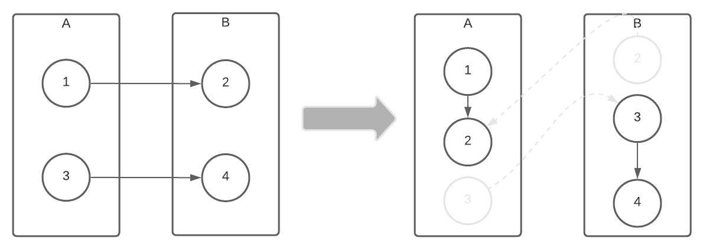
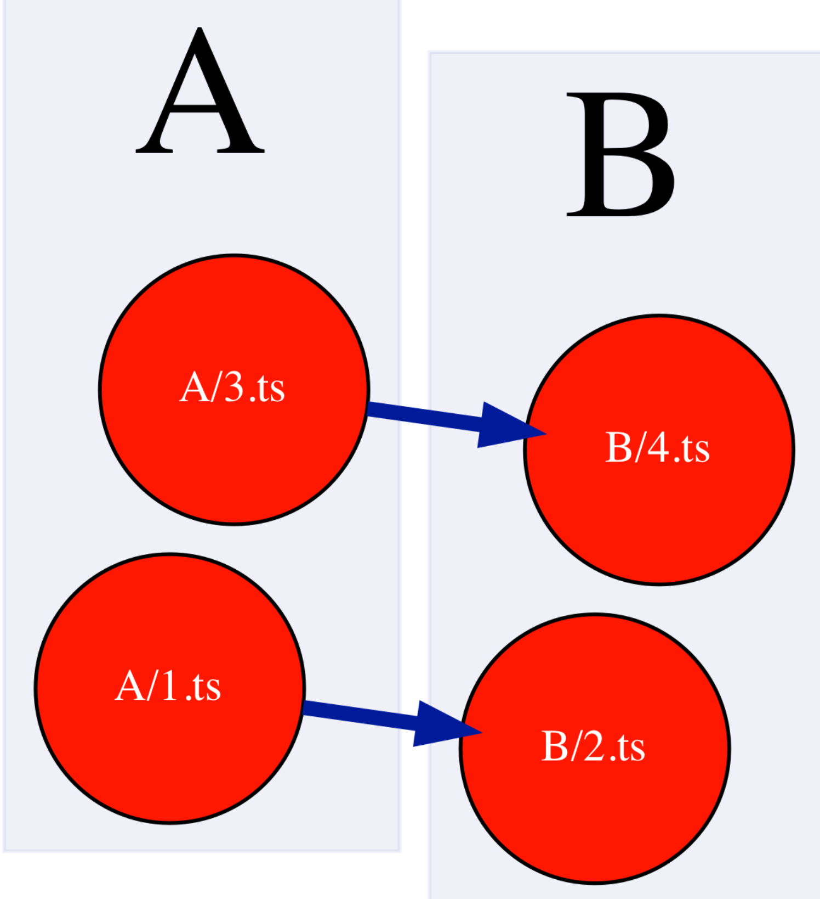
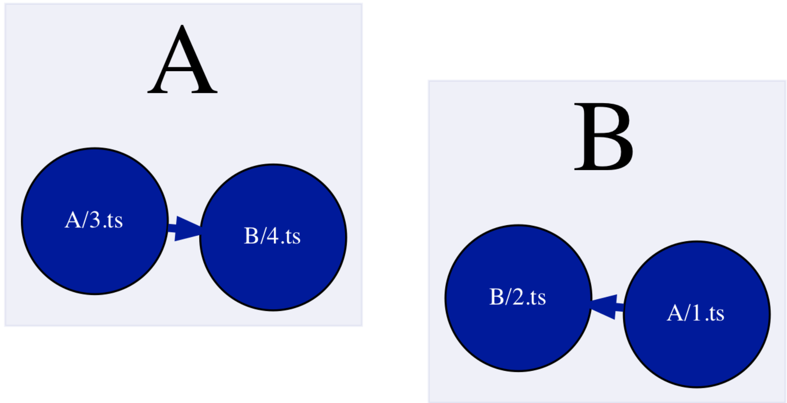
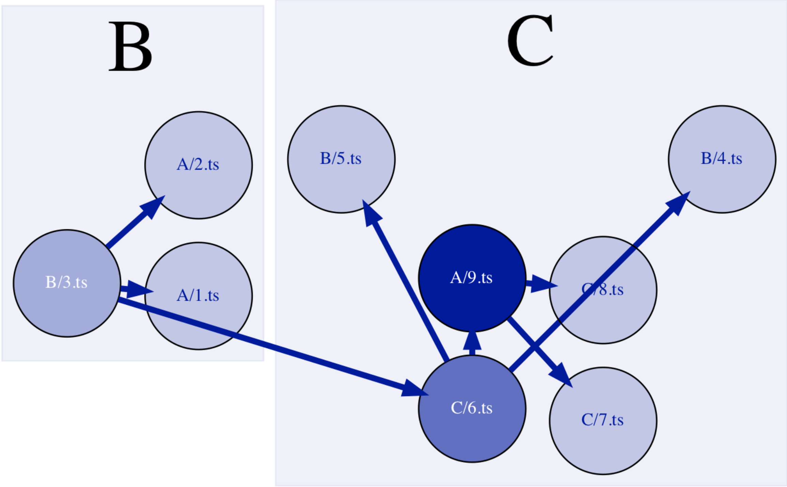
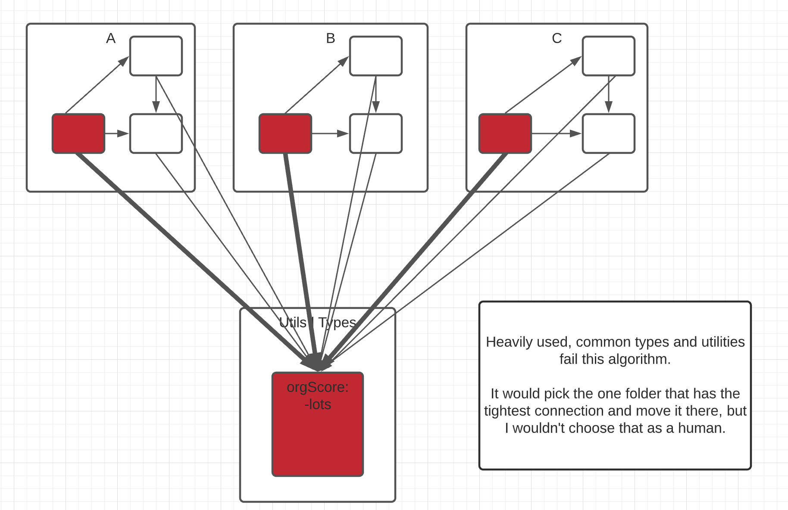

_Measuring Coupling and Cohesion of TypeScript code bases_

Earlier this month I was exploring creating [dependency graphs of github repositories](https://www.staceygammon.com/architecture_art/). The one thing lacking from that exploration was having something actionable come out of the graph. How can you tell, especially for very large, complicated repositories, whether the graph is well-organized, or a tightly coupled mess?

## Cohesion

Cohesion can be thought of as how well components in a single module fit together. In the following image, the visualization on the right has higher cohesion than the left. But how do you measure it? It's easy to compare the cohesion of these very two simple modules, but [more realistic graphs](https://www.staceygammon.com/architecture_art/), especially on large code bases, are much more difficult to look at and determine whether the cohesion of any given module is "good" or "bad".


## Coupling

Coupling is how tightly connected components in _separate_ modules are. In the following image, the visualization on the left has tighter coupling than the right. However, how do you measure it and determine whether it's level of coupling is "good" or "bad"? Any software engineer could look at the image on the left and tell you it was a terribly organized code base, but it's an extreme. Similar to the above, when looking at more real-world code bases, how does one whether their organization is good, or bad, and what could be done to improve it? We don't want 0 coupling it would make refactoring common code impossible.


## Organization score

I've been exploring ways to programmtically measure these attributes and come up with actionable recommendations to improve the organization. Which nodes have low cohesion and high coupling, such that moving them to another module would improve cohesion and decrease coupling? For example, given the following, extremely simple made up organization, where `A` and `B` are folders, `1` and `2` are files, and the lines indicate the dependencies between them, could a program recommend changing the grouping?



After some modifications to the original algorithm, in order to promote balance, it works!

|  |  |


The following formula is used to calculate the orgScore:

```
 orgScore = interDependencyCount - max(intraDependencyCount(parentFolder)).
```

`max(intraDependencyCount(parentFolder))` means it takes the dependency weights from each node that comes from a separate parent and takes the max of it. Inter-dependency count is how many internal connections is has to it's siblings.

This means the node has a stronger connection with the nodes of another parent rather than itself. 
If we have `A/1` -> `A/2`, `A/1` -> `B/3`, `A/1` -> `B/4`, then the orgScore would be `1 - max([B, 2])` = `1 - 2` = `-2`.

If the org score is negative, than a recommendation is suggested. Once all the recommendations are given, they are applied, and recalculated after each application. If a move is made, the actual recommendation may be different from the initial list of recommendations.

For example, with the example above the Nodes have the following org scores:

| Source Node | Org Score |
|------------|---------------|
| A/1 | -1 |
| A/3 | -1 |
| B/2 | -1 |
| B/4 | -1 |

And the following list of initial move recommendations:

| Node | New Parent |
|------------|---------------|
| A/1 | B |
| A/3 | B |
| B/2 | A |
| B/4 | A |

If we made that entire list of recommendations in a row, we'd be right back where we started! When we apply them and recalculate, making sure to apply one parent node at a time, in order to promote balance, the final moves made are:

| Node | New Parent |
|----|----|
| A/1.ts | B |
| B/4.ts | A |

You can replicate these findings ourself by running the [tsDependencyGrapher](https://github.com/stacey-gammon/ts_dependency_grapher) with the following config.json:

```
{
    "repos": [
        { 
            "full_name": "stacey-gammon/ts_dependency_grapher",
            "tsconfig": "./examples/simple_bad/tsconfig.json",
            "source": "file",
            "outputName": "simple_bad",
            "refresh": true
        }
    ],
    "outputFolder": ".",
    "excludeFilePaths" : ["_test_", ".test.ts"],
    "nodeColorWeight": "OrgScore",
    "nodeSizeWeight": "PublicAPICount",
    "zooms": [4],
}
```

## Add a bit more complexity

Let's now expand this to two new example code organizations:


Using red colors to indicate nodes with larger negative org scores, and blue colors to indicate nodes with larger positive org scores, the graphs are representative of the numbers in a visual manner:


Running the logic on them, the nicely organized graph comes up with no recommendations, while the poorly organized one ends up as:



Unfortunately, this isn't as balanced as I would have liked, so that part of the algorithm could use some modification.
## Follow-ups 

### Improving the balancing

One problem with this algorithm is that it optimizes one giant module. If every node is in a single folder, the org score would be very high because it would have no intra-dependencies and many inter-dependencies. 

 It doesn't make any recommendations to split one large folder into two.

### Accounting for common code



Another issue with te algorithm is common utilities and types. They may have few connections to other functionality in a folder, and strong connections to many other modules. The algorithm would pick one that has the strongest connection and put it in there but that is not how engineers usually organize common utilities and types. These are usually more discoverable if they are in a separate folder.