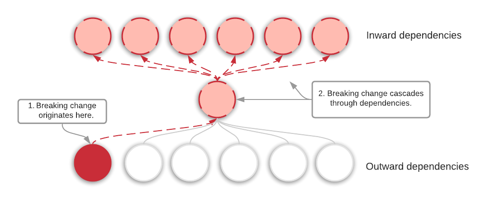
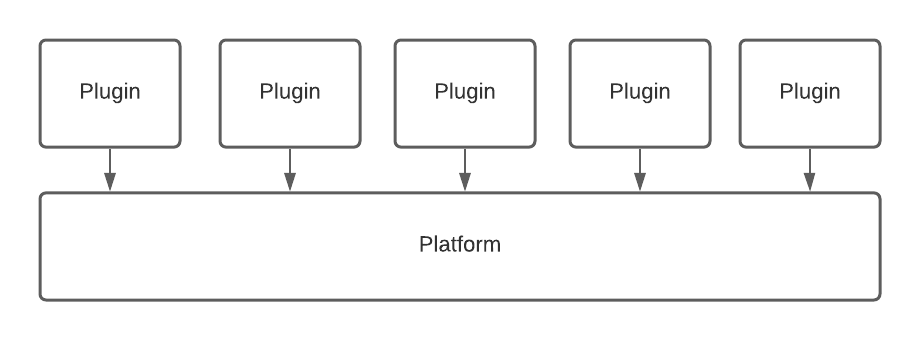
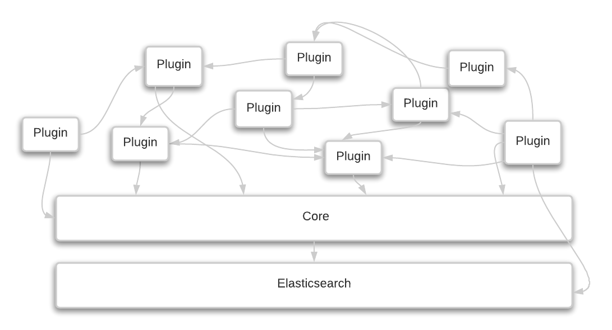
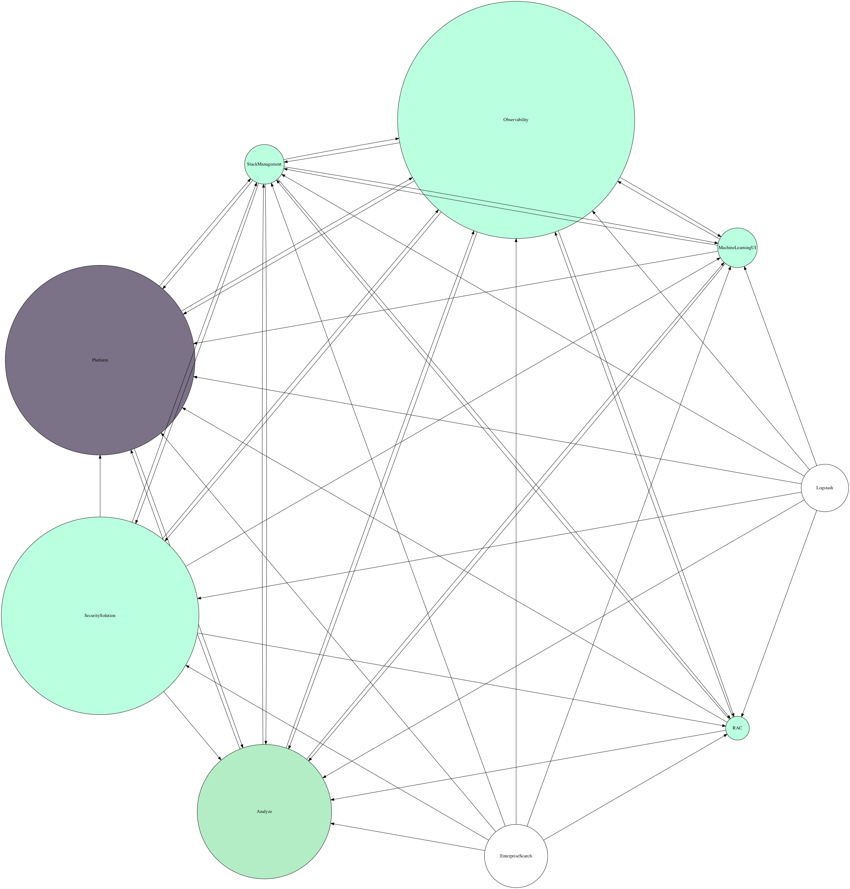
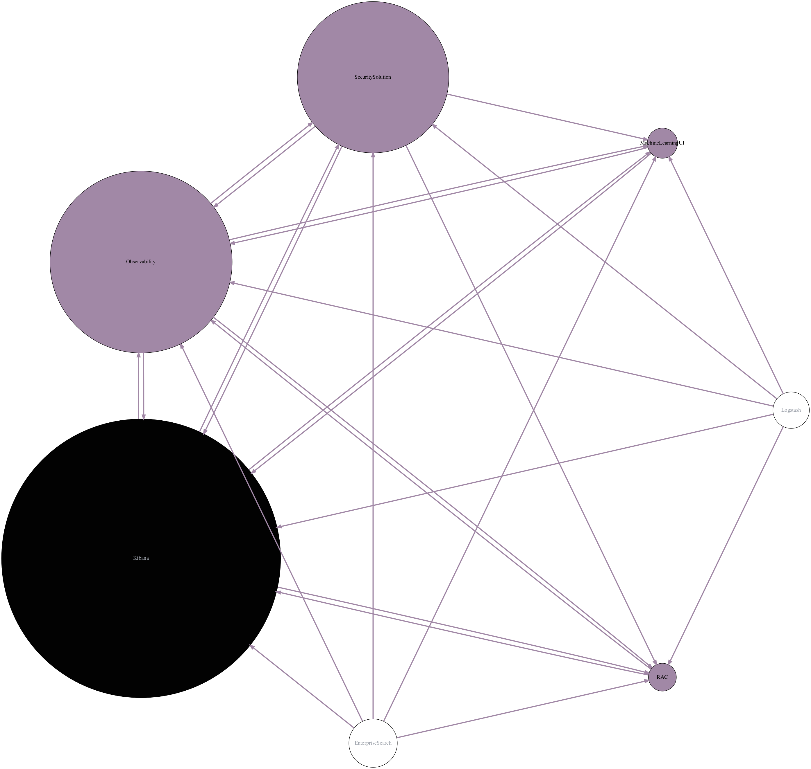
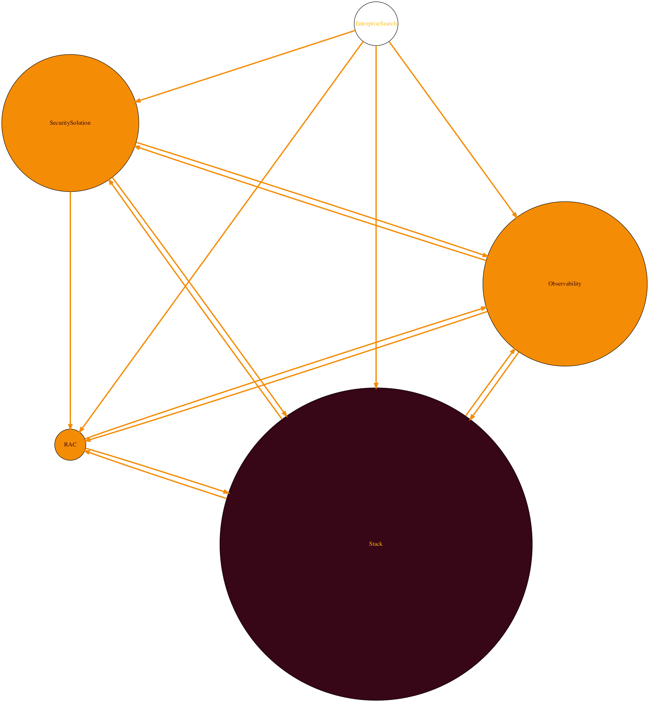
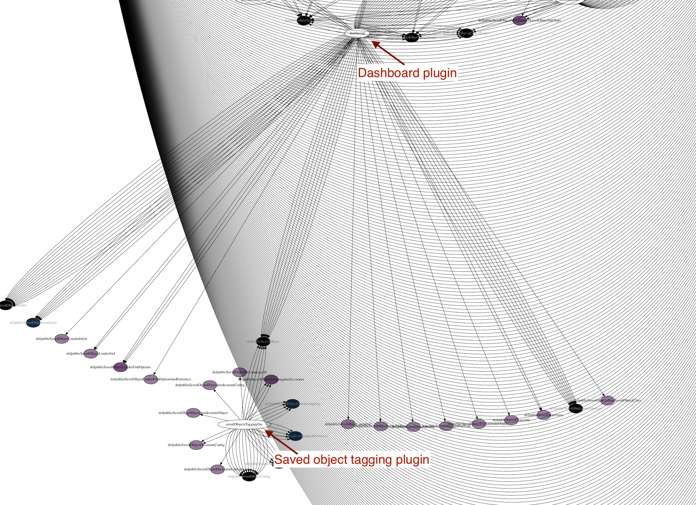
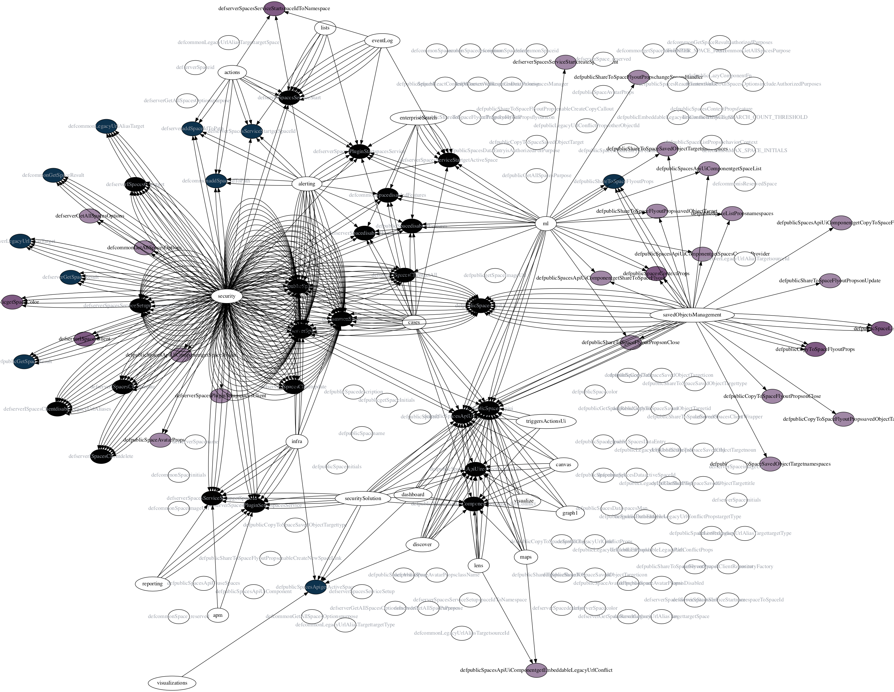

_Visualizing Coupling and Cohesion using [GraphVis](https://graphviz.org/) and [ts-morph](https://github.com/dsherret/ts-morph)._

## Measuring software quality

It’s generally understood that **high-quality software has low coupling and high cohesion**. There is less risk that code churn will require cascading breaking changes when there are fewer dependencies (e.g. less coupling).

With this in mind, I decided to see if I could visualize Kibana’s plugin dependency graph. My hope is that it would give more weight behind multiple initiatives I’ve been hoping to see through: decoupling our code-base, creating a more maintainable architecture, and minimizing our public plugin API, all with the aim of decreasing time to market and improving developer efficiency.

## Brief architectural background

Almost everything you see in the [Kibana UI](https://demo.elastic.co/) is written inside a plugin. Any plugin can not only extend and enhance Kibana’s basic functionality, but it can also share functionality with other plugins. Where many plugin systems look something like this: 

Our architecture tends to look more like this:

Or more accurately, it looks like this:

_Click on each image to be taken to a larger version hosted in GitHub_.

The bigger the node, the larger of a public API it has. The darker the node, the more incoming dependencies it has. There are so many nodes and edges in the above graph, that while I thought it did a good job of proving high coupling, there wasn’t too much else I could glean from it, though I think it makes nice artwork. I particularly like this view using the circo layout engine:

Kibana supports grouping plugins inside sub-folders, but too few take advantage of it, to make it possible to “zoom-out” a level using the code.

## Visualizing team dependencies

[Conway’s law](https://en.wikipedia.org/wiki/Conway%27s_law) states that your architecture will mirror your organizational structure. If the plugin dependency graph was too detailed, perhaps I could zoom out by grouping them by the team owner. 

In this variation, I still included the plugin nodes within each cluster. I also sized each plugin node based on its relative public plugin API size and colored it based on the number of incoming dependencies (aka afferent coupling, or Ca). Afferent coupling can be good. It means you’ve refactored useful, common code together.  [One source](https://searchapparchitecture.techtarget.com/tip/The-basics-of-software-coupling-metrics-and-concepts) states that modules with high afferent coupling should be small and take on few responsibilities. In other words, big circles with warm colors = bad.

You can see two very large plugins that have a lot of incoming dependencies. This could be an area for improvement.

There is still a lot going on, so I decided to build a variation that doesn’t include the plugins nodes, only the team nodes. Perhaps we can better understand why so many of our projects involve heavy cross-team coordination!

In this variation, the darker the color of the nodes, the more incoming dependencies they have. I'm using the total number of _plugin_ dependencies, so one team could theoretically have only one incoming edge (one team) but if that team has many plugins relying on that team, the color may be surprisingly dark.  I've also sized the nodes based on team size. Unfortunately each plugin team owner (`owner.name` in every plugin's `kibana.json` file) may not correlate specifically with a team in our org. I tried my best to only count folks once, and made a best guess where I had to. In other words, it's not entirely accurate!

| Color based on incoming dependencies | Color based on API size |
|-------|---------|
|  |   |

It's hard to see but the App Services team has the most incoming dependencies and the largest API size, yet it is not the largest based on team size. To be fair, only the plugins Core owns are being counted, not _actual_ core functionality, since no plugin needs to list that in their dependencies in `kibana.json` and that is what I am using. 

Whether the color is inward dependency based or API size based, they seem pretty similar. What I would ideally measure is _average incoming reference count_ of each of the team's APIs. Otherwise, a plugin may export many public APIs, but only a handful of them are used frequently. In that case, they should be removing the unreferenced public APIs.

Each of our “Area teams” falls into a larger “Group team”, so I zoomed out another level.

_Dependencies among groups, darker colors mean more incoming dependencies, size is based on team size. The color scheme is different here, hence the mint._

Some of our group teams can be collapsed under the Kibana umbrella.

The final zoom out level - our 3+1 org structure (I used yet another color scheme, not to confuse you, but I did title this "Architecture Art", and I wanted to get creative :)).

## Zooming in

So what can we do about all of this tight coupling between plugins and teams? One option is to zoom in and see certain plugins have low cohesion which might be contributing to the tight coupling. Are there certain API items we can move into their own package?  These decisions will impact our page load speed. Our plugins will be moving to packages soon. If an application only uses one function from a large package, there is a lot of code being downloaded unnecessarily.

### Saved Objects

For example, look at this representation of the saved objects plugin (Saved Objects are a part of core, but there is an additional plugin with more extension points).

Zooming in, it appears there are a bunch of API points that are only needed by the Dashboard plugin, and another chunk only used by the Saved Object Tagging plugin. If an API items is only used by a single other plugin, it would reduce coupling and increase cohesion to move it _into_ that plugin as a private implementation detail. Of course, it will depend on how coupled those APIs are to internal private details of the Saved Object plugin, which is not being captured in this doc.

### Spaces

## Follow ups

One challenge is the time it takes to gather all references to a single API endpoint. We have over 24,000 public API types "items" (types, functions, classes, objects, etc). In a code base with 2.4 million lines of code, running `findReferences` on each of those can take a long time. The last time I tried this on the `data` plugin I gave up and killed the process after 4 hours. I'd also expect the resulting to PNG artwork to be massive to say the least (the big ones were already reaching up to 150MB).  Still, this is an avenue I would like to explore further.

Another angle I would like to tackle is figuring out how to build these graphs in any type of typescript codebase. I use some specialized knowledge of how Kibana is set up to create these. For example, plugins have specially defined public boundaries (exports from specific files), and each plugin maps to an owner via a special `kibana.json` file. I would be interested in seeing how to generalize this logic however. Personalized Architecture Art!
