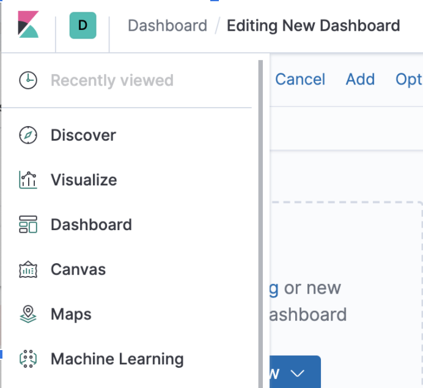
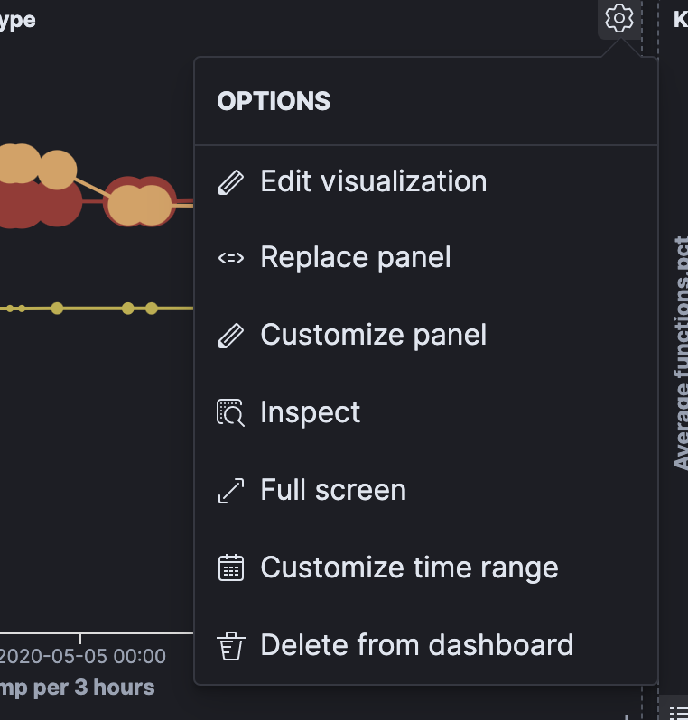
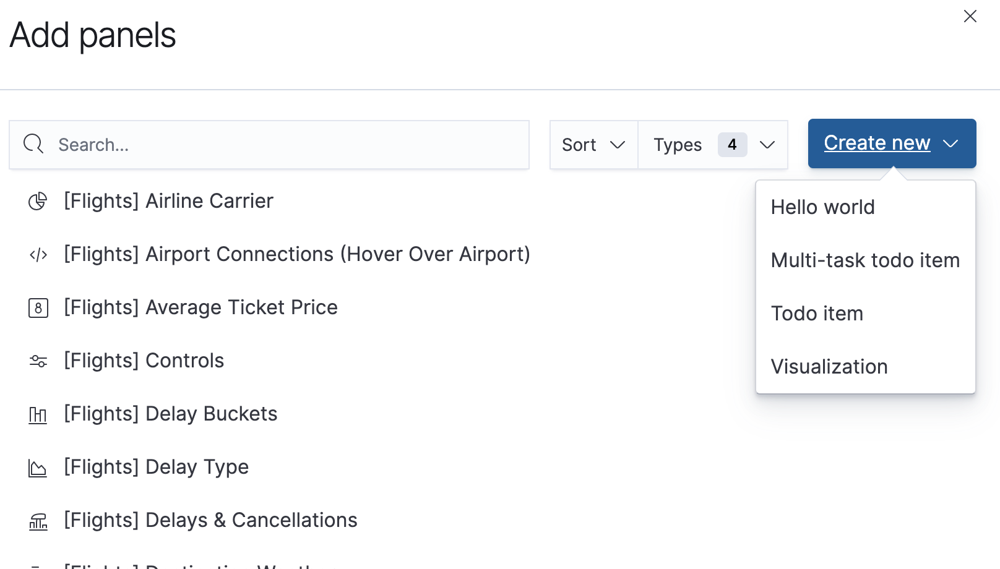
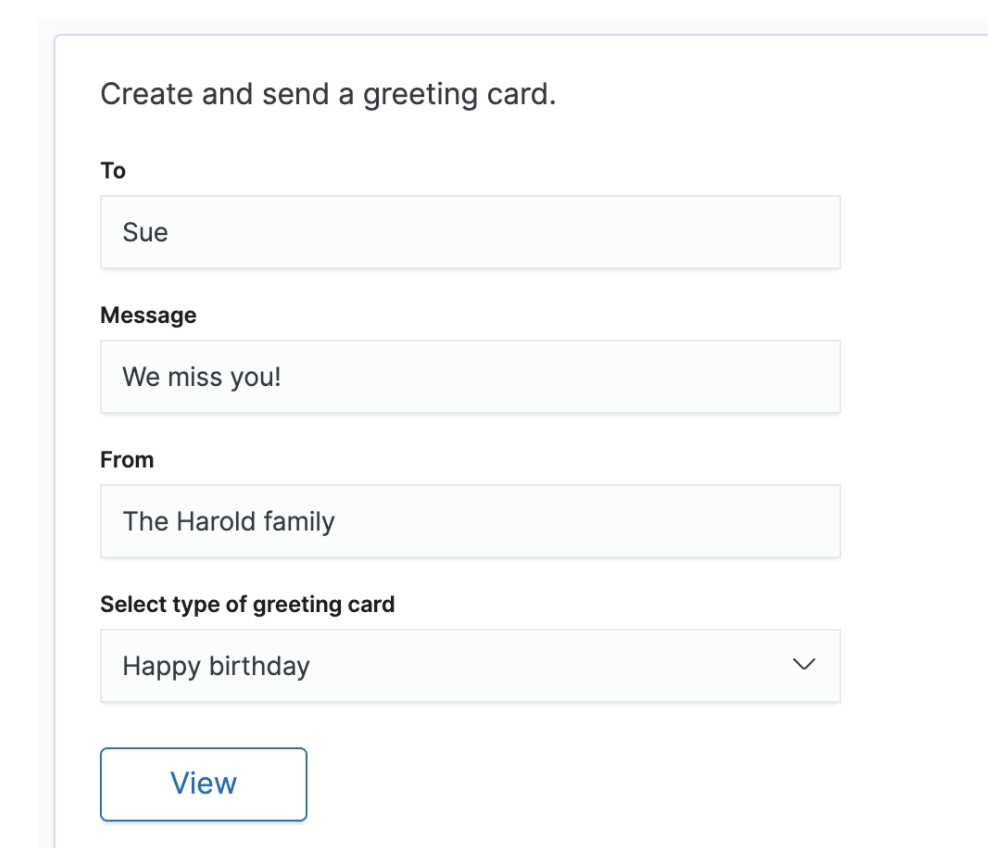
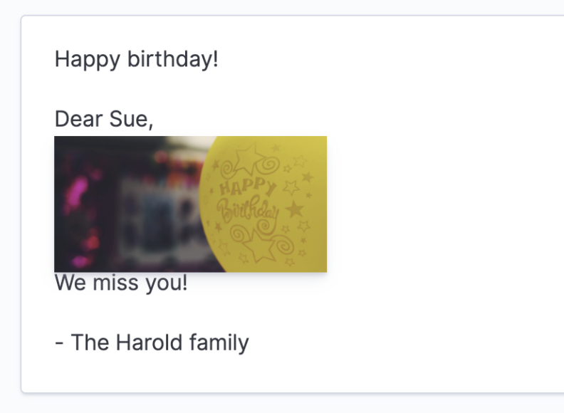

## Goals

By the end of this post you should understand the differences and similarities between registries,
pluggable extension points, plugins, and applications. 

This is written right around the release of 7.7, so things may change in the future, as Kibana APIs
are still under quite a bit of fluctuation.

## Terminology

### Plugin

A plugin is code a developer writes that does not have to be part of the kibana repo.
 - A plugin is an integral concept in Kibana
 - A plugin can register an application, or not.
 - A plugin makes use of core's, or other plugin’s, extension points.
 - The primary example is registering an application.

### Application

An application is something that shows up in the navigation menu. Discover, Dashboard, Visualize,
Canvas, Maps - these are all applications.



<br/>

You can see an example of registering an application 
[here](https://github.com/stacey-gammon/kibana-plugins/blob/master/plugins/greeting_cards_v1/public/plugin.ts#L6)

```ts
core.application.register({
    id: 'greetingCards',
    title: 'Greeting cards',
    async mount(params: AppMountParameters) {
      const [coreStart] = await core.getStartServices();
      const { renderApp } = await import('./app');
      const services = createServiceWrapper(coreStart);
      return renderApp({ appBasePath: params.appBasePath, services }, params.element);
    },
  });
```

### Extension points

Extension points are certain functions exposed from core, or other plugin’s setup and start
contracts, to allow a developer to customize Kibana’s experience. For instance the code above
uses a core extension point, `core.application.register`, to add custom applications.

You can access all core extension points as the first parameter passed into a plugin's `setup`
function ([CoreSetup](https://github.com/elastic/kibana/blob/7.7/docs/development/core/public/kibana-plugin-core-public.coresetup.md)), 
and `start` ([CoreStart](https://github.com/elastic/kibana/blob/7.7/docs/development/core/public/kibana-plugin-core-public.corestart.md)) functions.

```ts
class MyPlugin extends Plugin {
  setup(core: CoreSetup) {...}
  start(core: CoreStart) {...}
}
```

You can access other plugin's extension points from the second parameter that goes into these plugin
lifecycle functions:

```ts
class MyPlugin extends Plugin {
  setup(core: CoreSetup, { fooPlugin, barPlugin, uiActions }: MyPluginSetupDependences) {...}
  start(core: CoreStart, { fooPlugin, barPlugin, embeddables }: MyPluginStartDependences) {...}
}
```

Don't forget though, if you want access to a certain plugin's extension points, you have to add it
as a required or optional dependency in your `kibana.json` file:

```
{
  "id": "demoSearch",
  "version": "0.0.1",
  "kibanaVersion": "kibana",
  "configPath": ["demoSearch"],
  "server": true,
  "ui": true,
  "requiredPlugins": ["fooPlugin", "uiActions"],
  "optionalPlugins": ["barPlugin", "embeddables"]
}
```

Not every function exposed is considered an "extension point".  For example, 
`core.http.fetch` is a helper function for grabbing data with authentication injected. Since
in and of itself, this wouldn't have any direct side affects to a user's experience of Kibana,
I wouldn't call it an "extension point".

Some more examples of extension points:

 - core.application.register
 - core.notifications.toasts.addSuccess
 - core.overlays.showModal
 - embeddables.registerEmbeddableFactory
 - uiActions.registerAction
 - alerts.registerNavigation
 - alerting.registerType
 - core.savedObjects.registerType


### Registries

Registries are stateful extension points. They contain the registered things. These registered 
things often have to adhere to a certain generic shape, depending on the registry.  Registries are used 
primarily for two situations:
 - when a list of things is going to be displayed in the UI somewhere
 - when the state that is used to create instances of these things ends up serialized and persisted somewhere.

 One <a href="https://github.com/elastic/kibana/blob/7.7/x-pack/plugins/advanced_ui_actions/public/plugin.ts#L70">example of the former</a> is how we display all registered uiActions attached to the
 `CONTEXT_MENU_TRIGGER` here

 

<br/>

The latter example is often in conjunction with the former. For instance, certain registered embeddables
are dynamically displayed in the UI:



<br/>

But the embeddable registry is also <a href="https://github.com/elastic/kibana/blob/7.7/src/plugins/embeddable/public/lib/containers/container.ts#L309">how we deserialize this data when it's persisted</a>.

<A href="https://github.com/elastic/kibana/tree/7.7/examples/url_generators_examples">URL generators</a> is one
example of a registry of items that is only used for serialization and deserialization.


Some more examples of registries are: 
 - core.application.register
 - embeddables.registerEmbeddableFactory
 - uiActions.registerAction
 - alerts.registerNavigation
 - alerting.registerType
 - core.savedObjects.registerType

Examples of extensions points that are not considered registries:
 - core.notifications.toasts.addSuccess
 - core.overlays.showModal

## A story of greeting cards

Lets start with a very simple story to explain where registries come into play.

This blog post is only going to touch on the first part of the story. I'll have to write more later
to get to the part where a registry is actually implemented.

### Phase 1: Build a simple greeting card application

Lets build a plugin in Kibana that creates greeting cards.

You can explore 
<a href="https://github.com/stacey-gammon/kibana-plugins/blob/master/plugins/greeting_cards_v1">the code here </a>.

It's very simple. It lets you create two kinds of greeting cards, "Get well soon", and "Happy birthday", and add
some personalization to it:



<br/>

Then you can view it, in full screen mode: 



<br/>

### Pitfalls

I used some antipatterns on purpose in this example.

I hard coded the greeting card types. If I want to add another one, I'm going to have to add
multiple "if" statements

This is not very maintainable. 

This is a code smell. 

Instead of having to add an extra conditional statement for every type of greeting card, lets create an
abstraction layer - a registry of greeting card types - that we can use dynamically.

That's all for now. Stay tuned for part 2!
