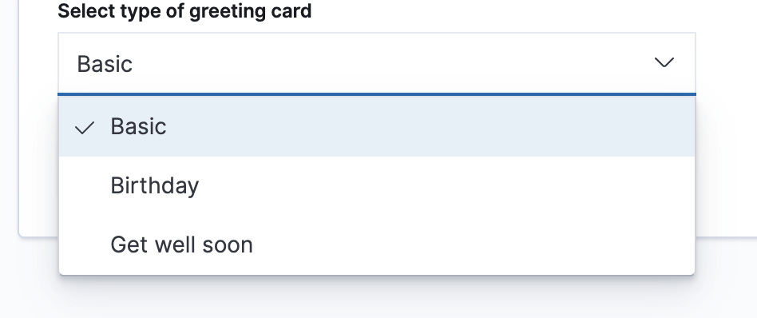

## Goals

By the end of this post you should:

- Understand what a registry is and how to create one
- Understand when to use one

## Brush up on the basics

Be sure to read [The Basics of Kibana Pluggability Part 1](../basics_of_kibana_pluggability) before reading this.

## Why use a registry?

Back in part 1, I showed a [simple example of a plugin](https://github.com/stacey-gammon/kibana-plugins/tree/master/plugins/greeting_cards_v1)
 that gave users the ability to create different types of
greeting cards. These greeting cards types were hard coded. For every new type I wanted to add, I'd have to add
an extra "if" statement.  That is no good!

In this second iteration of the plugin, I built an _internal registry_ of greeting card _templates_.

```ts
export interface GreetingCardPersonalization {
  message: string;
  to: string;
  from: string;
}

export interface GreetingCardTemplate {
  id: string;
  displayName: string;
  render: () => React.ReactType<GreetingCardPersonalization>;
}
```
[View code](https://github.com/stacey-gammon/kibana-plugins/blob/master/plugins/greeting_cards_v2/public/types.ts)

I add these items in the `setup` lifecycle of my plugin

```ts
  public setup(core: CoreSetup) {
    const { BirthdayGreetingCard } = await import('./templates');
    return {
      id: 'birthday',
      displayName: 'Birthday',
      render: () => BirthdayGreetingCard,
    }
  });

  this.registerGreetingCardTemplate(async () => {
    const { GetWellSoonGreetingCard } = await import('./templates');
    return {
      id: 'getWellSoon',
      displayName: 'Get well soon',
      render: () => GetWellSoonGreetingCard
    }
  });
```
[View code](https://github.com/stacey-gammon/kibana-plugins/blob/master/plugins/greeting_cards_v2/public/plugin.tsx#L14)

Now, if I want to add a new type of greeting card, I just have to add a new registry item, and it shows up automatically.

```ts
// greeting_card_creator.tsx
<EuiFormRow label="Select type of greeting card">
  <EuiSuperSelect
    onChange={e => setTemplateId(e)}
    valueOfSelected={templateId}
    options={templates.map(template => ({ value: template.id, inputDisplay: template.displayName }))}
  />
</EuiFormRow>
```
[View code](https://github.com/stacey-gammon/kibana-plugins/blob/master/plugins/greeting_cards_v2/public/greeting_card_creator.tsx#L42)

```ts
// greeting_card_viewer.tsx
const Card = template.render();
return (
  <EuiPageContent>
    <Card to={to} message={message} from={from} />
  </EuiPageContent>
);
```
[View code](https://github.com/stacey-gammon/kibana-plugins/blob/master/plugins/greeting_cards_v2/public/greeting_card_viewer.tsx)

Another benefit of this abstraction layer, is that I can customize the rendering of each greeting card type.

## Adding a new registry item

Now adding a new greeting card type is very simple, and I only have to touch one file:


```ts
// plugin.ts
this.registerGreetingCardTemplate(async () => {
  return {
    id: 'lame',
    displayName: 'Basic',
    render: () => ({ to, message, from }) => <div>{`Hi ${to}, ${message}, from ${from}`}</div>,
  }
});
```
[View code](https://github.com/stacey-gammon/kibana-plugins/blob/master/plugins/greeting_cards_v2/public/plugin.tsx#L14)

And it shows up automatically!

 


 


##  Pitfalls and Limitations

So far, I haven't exposed any extension points in my plugin. The only way to add new greeting card templates is 
to write code directly into my plugin. This is limiting. I only have so much time, and users of my now very popular
greeting card application are clamouring for new greeting card types. Some of those users have very specific needs. I don't
want to be in the business of creating and maintaining hundreds of greeting card templates.

So what should I do?

Expose my first extension point!

## What's next?

Stay tuned for Part 3, and I'll walk through creating your plugin's first public API.