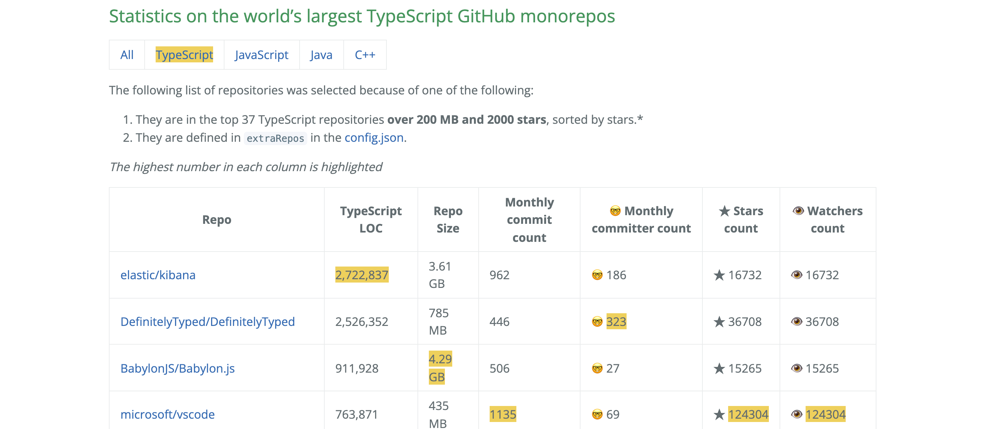

This past week I started as a quest to see just how large the Elastic Kibana TypeScript monorepo is compared with other TypeScript monorepos on GitHub. Spoiler alert: it's the biggest! 

 

Check out the full list [here](https://stacey-gammon.github.io/repo-stats/index.html), which includes breakdowns by other languages as well, including Java, JavaScript and C++. Elasticsearch is the third largest in the java category.

The code to create this list is [available here](https://github.com/stacey-gammon/repo-stats). Unfortunately it is very slow to run because counting lines of code requires cloning the each repository locally. 

There is a `config.json` file which can be used to manually add various repositories to compare, along with some other configuration settings.