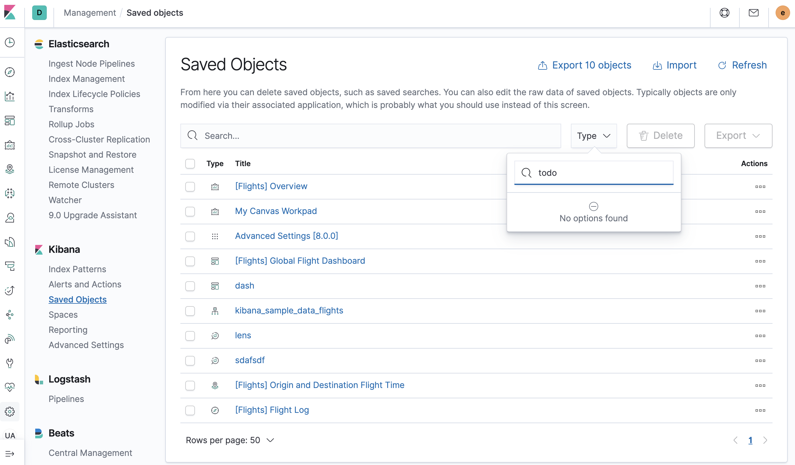
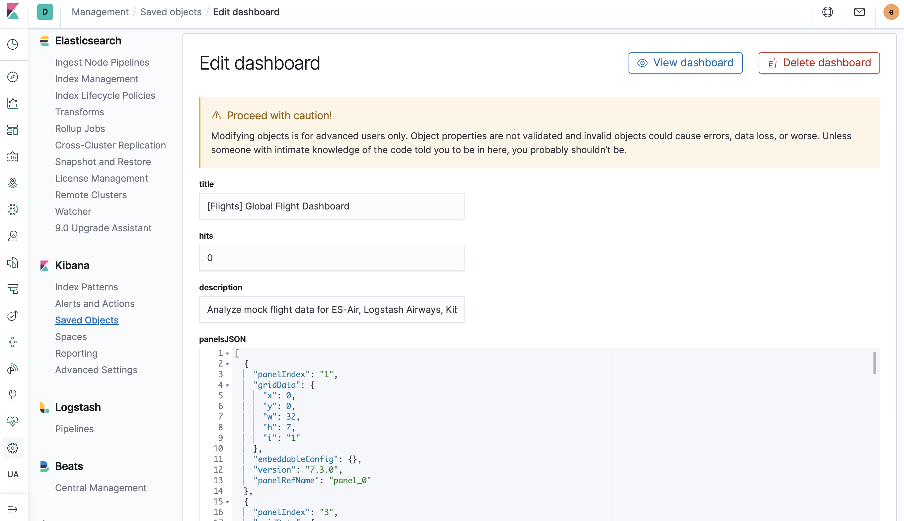

## Searching for and deleting new Saved Object types in Kibana using Dev Tools

### Setup

To go through this tutorial with me, you'll need to have a local development setup
of `Kibana` locally. You can read this [Contributing guide](https://github.com/elastic/kibana/blob/master/CONTRIBUTING.md#setting-up-your-development-environment) to get you started, then run Kibana
locally using:

```
yarn start --run-examples
```

There is no specific example plugin for this, but the `Embeddable Examples` includes code
that registers a [new saved object type](https://github.com/elastic/kibana/blob/master/examples/embeddable_examples/server/todo_saved_object.ts#L22).
Visit the `Embeddable Explorer` app once and it'll add a new Todo Saved Object.

### Walk through

Often times developing plugins in Kibana means creating new saved object types.
These types do not get automatically added to the `Saved Object Management` section:



Even if they do, not all saved object types support the `inpsect` action. Dashboard is one that
does so you can see all the fields of a particular instance of a Saved Object:



Dev tools can be your friend here, to view the raw data backing a saved object, and also to
do some clean up. You can do things like:

#### Search by type

```
GET .kibana*/_search
{
  "query": {
    "match": {
      "type": "todo"
    }
  }
}
```

Returns:

```
{
  "took" : 0,
  "timed_out" : false,
  "_shards" : {
    "total" : 4,
    "successful" : 4,
    "skipped" : 0,
    "failed" : 0
  },
  "hits" : {
    "total" : {
      "value" : 1,
      "relation" : "eq"
    },
    "max_score" : 4.0488815,
    "hits" : [
      {
        "_index" : ".kibana_2",
        "_id" : "todo:sample-todo-saved-object",
        "_score" : 4.0488815,
        "_source" : {
          "todo" : {
            "task" : "Take the garbage out",
            "title" : "Garbage",
            "icon" : "trash"
          },
          "type" : "todo",
          "references" : [ ],
          "updated_at" : "2020-05-05T17:47:40.513Z"
        }
      }
    ]
  }
}
```

#### Search by title

```
GET .kibana*/_search
{
  "query": {
    "match": {
      "todo.title": "Garbage"
    }
  }
}
```

Or use a wildcard:

```
GET .kibana*/_search
{
  "query": {
    "wildcard": {
      "todo.title": "Garb*"
    }
  }
}
```

#### Delete by type

```
POST /.kibana*/_delete_by_query
{
  "query": {
    "match": {
      "type": "visualization"
    }
  }
}
```

#### Delete by title

```
POST /.kibana*/_delete_by_query
{
  "query": {
    "match": {
      "todo.title": "Garbage"
    }
  }
}
```

Happy developing!