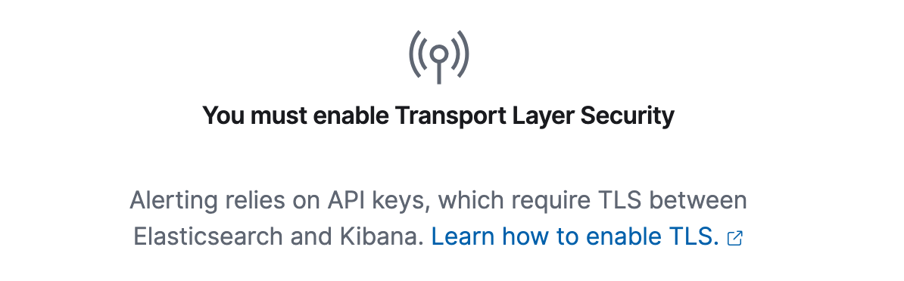
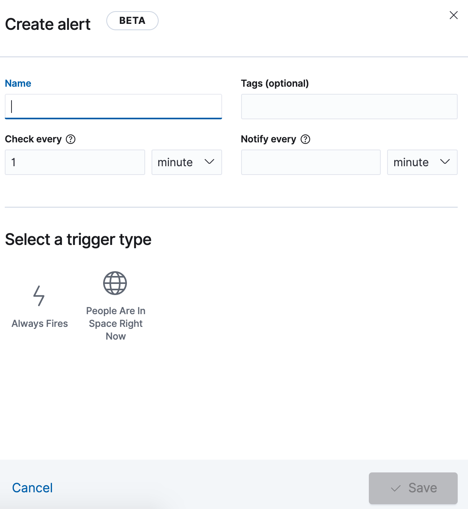

## Developing Kibana with TLS and SSL turned on

Some features in Kibana require advanced security settings like TLS or SSL setup and enabled. If you run with 
developer examples (`yarn start --run-examples`), and try to create an alert inside the "Kibana alerting" example, you will
see a comment that you need to turn TLS on:



The easiest way to do so, without going through all the instructions linked to in that
screenshot, is to boot up both Kibana and Elasticsearch with ssl enabled:

```
yarn start --run-examples --ssl
```

```
yarn es snapshot --license trial --ssl
```

And voila, alerting will now be available to you to play around with:


